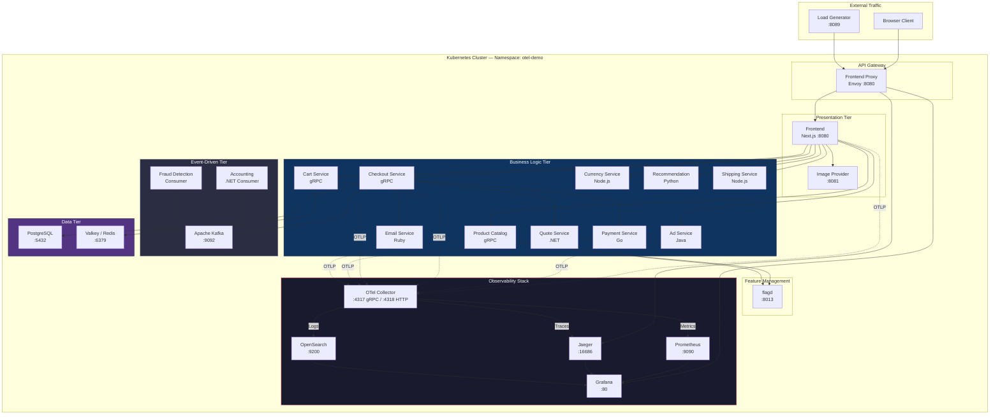
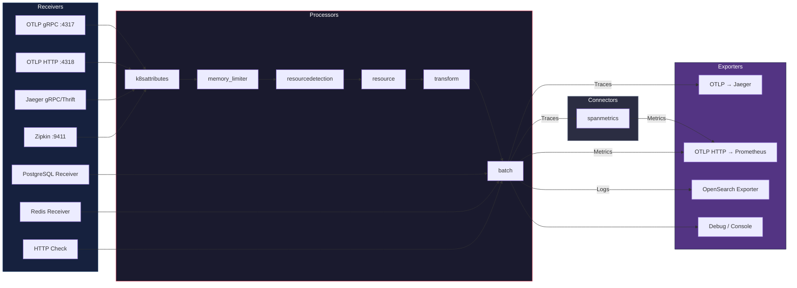

# OpenTelemetry Demo - Full-Stack Observability on Kubernetes

## Overview

This project deploys the **OpenTelemetry Astronomy Shop**, a cloud-native microservices e-commerce application fully instrumented with OpenTelemetry, onto Kubernetes. It demonstrates end-to-end distributed tracing, metrics collection, and log aggregation across 17+ polyglot microservices backed by a production-grade observability stack (Jaeger, Prometheus, Grafana, OpenSearch).

The entire deployment is packaged as a single consolidated Kubernetes manifest (`opentelemetry-demo.yaml`) generated from Helm charts, making it straightforward to deploy in any Kubernetes cluster.

---

## Architecture

The system follows a **microservices architecture** with a centralized **OpenTelemetry Collector** acting as the telemetry data pipeline. All services emit traces, metrics, and logs via OTLP to the collector, which routes data to the appropriate backends.

### High-Level Architecture



### Telemetry Pipeline (Collector Detail)



---

## Tech Stack

| Layer | Technology | Version |
|---|---|---|
| **Container Orchestration** | Kubernetes | Any (1.24+) |
| **Manifest Generation** | Helm | Generated offline |
| **Distributed Tracing** | Jaeger (All-in-One) | 1.53.0 |
| **Metrics** | Prometheus | v3.6.0 |
| **Dashboards** | Grafana | 12.1.1 |
| **Log Storage** | OpenSearch | 3.2.0 |
| **Telemetry Pipeline** | OTel Collector Contrib | 0.135.0 |
| **Caching** | Valkey (Redis-compatible) | 8.1.3-alpine |
| **Database** | PostgreSQL | bundled |
| **Streaming** | Apache Kafka | bundled |
| **Feature Flags** | flagd (OpenFeature) | bundled |
| **Demo App** | OpenTelemetry Demo | 2.1.3 |

---

## Kubernetes Resources

| Resource Type | Count | Key Resources |
|---|---|---|
| **Namespace** | 1 | `otel-demo` |
| **Deployments** | 24 | All microservices + infra |
| **StatefulSets** | 1 | OpenSearch |
| **Services** | 26 | ClusterIP + Headless |
| **ConfigMaps** | 17 | Collector config, Grafana dashboards, Prometheus scrape configs |
| **Secrets** | 1 | Grafana credentials |
| **ServiceAccounts** | 5 | Per-component RBAC |
| **ClusterRoles** | 3 | Grafana, Collector, Prometheus |
| **ClusterRoleBindings** | 5 | RBAC bindings |
| **PodDisruptionBudgets** | 1 | OpenSearch availability |
| **Total** | **~83** | |

---

## Microservices Inventory

### Application Services

| Service | Language/Runtime | Port | Description |
|---|---|---|---|
| `frontend` | Next.js | 8080 | Web storefront UI |
| `frontend-proxy` | Envoy | 8080 | API gateway / reverse proxy |
| `ad` | Java | 8080 | Advertisement engine |
| `cart` | gRPC | 8080 | Shopping cart (backed by Valkey) |
| `checkout` | gRPC | 8080 | Order processing |
| `currency` | Node.js | 8080 | Currency conversion |
| `email` | Ruby | 8080 | Email notifications |
| `payment` | Go | 8080 | Payment processing |
| `product-catalog` | gRPC | 8080 | Product inventory |
| `quote` | .NET | 8080 | Shipping quote generation |
| `recommendation` | Python | 8080 | ML-based product recommendations |
| `shipping` | Node.js | 8080 | Shipping logistics |
| `accounting` | .NET | -- | Kafka consumer for financial records |
| `fraud-detection` | Kotlin | -- | Kafka consumer for risk analysis |
| `image-provider` | -- | 8081 | Product image hosting |
| `load-generator` | Locust | 8089 | Synthetic traffic generation |

### Data & Infrastructure Services

| Service | Technology | Port | Description |
|---|---|---|---|
| `postgresql` | PostgreSQL | 5432 | Relational database |
| `kafka` | Apache Kafka | 9092 / 9093 | Event streaming platform |
| `valkey-cart` | Valkey (Redis) | 6379 | In-memory cart cache |
| `flagd` | OpenFeature flagd | 8013 / 8016 | Feature flag evaluation |

---

## Observability Components

### Grafana Dashboards (Pre-configured)

| Dashboard | Description |
|---|---|
| APM Dashboard | Application Performance Monitoring overview |
| Demo Dashboard | OpenTelemetry demo-specific metrics |
| Exemplars Dashboard | Trace exemplars linked to metrics |
| SpanMetrics Dashboard | Metrics derived from trace spans |
| NGINX Metrics | Frontend proxy performance |
| OTel Collector | Collector pipeline health and throughput |
| PostgreSQL | Database performance and connections |
| Linux System | Host-level resource utilization |

### Datasources

| Source | Backend | Purpose |
|---|---|---|
| Prometheus | `http://prometheus:9090` | Metrics queries |
| Jaeger | `http://jaeger-query:16686` | Trace queries |
| OpenSearch | `http://opensearch:9200` | Log queries |

---

## Prerequisites

- Kubernetes cluster (v1.24+) with at least **8 GB RAM** and **4 CPU cores** available
- `kubectl` configured with cluster access
- Sufficient RBAC permissions to create ClusterRoles and ClusterRoleBindings

---

## Deployment

### Quick Start

```bash
# Clone the repository
git clone <repo-url>
cd otel

# Deploy all resources
kubectl apply -f opentelemetry-demo.yaml

# Verify all pods are running
kubectl get pods -n otel-demo -w
```

### Verify Deployment

```bash
# Check all resources
kubectl get all -n otel-demo

# Check pod status (expect ~24 pods)
kubectl get pods -n otel-demo

# Check services
kubectl get svc -n otel-demo
```

### Access the UIs

```bash
# Grafana (Dashboards) — admin:admin
kubectl port-forward svc/grafana -n otel-demo 8080:80

# Jaeger (Traces)
kubectl port-forward svc/jaeger-query -n otel-demo 16686:16686

# Prometheus (Metrics)
kubectl port-forward svc/prometheus -n otel-demo 9090:9090

# Frontend (E-commerce App)
kubectl port-forward svc/frontend-proxy -n otel-demo 8888:8080

# Load Generator (Locust)
kubectl port-forward svc/load-generator -n otel-demo 8089:8089
```

| UI | Local URL | Credentials |
|---|---|---|
| Grafana | http://localhost:8080 | admin / admin |
| Jaeger | http://localhost:16686 | -- |
| Prometheus | http://localhost:9090 | -- |
| E-commerce App | http://localhost:8888 | -- |
| Load Generator | http://localhost:8089 | -- |

---

## Configuration

### OpenTelemetry Instrumentation

All microservices share these environment variables:

```yaml
OTEL_SERVICE_NAME: <service-name>
OTEL_EXPORTER_OTLP_ENDPOINT: http://otel-collector:4317
OTEL_EXPORTER_OTLP_METRICS_TEMPORALITY_PREFERENCE: cumulative
OTEL_RESOURCE_ATTRIBUTES: service.name=<name>,service.namespace=opentelemetry-demo,service.version=2.1.3
```

### Key ConfigMaps

| ConfigMap | Purpose |
|---|---|
| `otel-collector` | Full collector pipeline (receivers, processors, exporters) |
| `prometheus` | Scrape targets and OTLP receiver config |
| `grafana` | Server, auth, and plugin settings |
| `grafana-datasources` | Prometheus, Jaeger, OpenSearch connections |
| `flagd-config` | Feature flag definitions |
| `product-catalog-products` | E-commerce product data |

### Database Credentials (Demo Only)

| Service | User | Password | Database |
|---|---|---|---|
| PostgreSQL | `root` | `otel` | `otel` |
| Grafana | `admin` | `admin` | -- |
| Valkey | -- | -- | -- |

---

## Security Considerations

> **Warning:** This deployment is configured for **demonstration purposes only** and is NOT production-ready.

| Concern | Current State | Production Recommendation |
|---|---|---|
| OpenSearch Security | Disabled | Enable security plugin + TLS |
| Grafana Auth | Anonymous access enabled | Enable OIDC/LDAP auth |
| Default Credentials | admin:admin | Use secrets manager (Vault, AWS SM) |
| TLS/mTLS | Not configured | Enable with cert-manager + Istio/Linkerd |
| Network Policies | None | Implement zero-trust NetworkPolicies |
| Secrets Management | Base64 in-manifest | Use External Secrets Operator |
| Pod Security | Non-root, basic | Add SecurityContext, PodSecurity Standards |

---

## Networking Flow

```
User/Browser
    │
    ▼
Frontend Proxy (Envoy :8080)
    │
    ├──► Frontend (Next.js) ──► Business Logic Services (gRPC/HTTP)
    ├──► Grafana (:80)                    │
    ├──► Jaeger UI (:16686)               ├──► PostgreSQL (:5432)
    │                                      ├──► Kafka (:9092)
    │                                      ├──► Valkey (:6379)
    │                                      └──► flagd (:8013)
    │
    └──► All Services ─── OTLP ───► OTel Collector (:4317/:4318)
                                         │
                                         ├──► Jaeger (Traces)
                                         ├──► Prometheus (Metrics)
                                         └──► OpenSearch (Logs)
```

---

## Cleanup

```bash
# Remove all resources
kubectl delete -f opentelemetry-demo.yaml

# Verify namespace deletion
kubectl get ns otel-demo
```

---

## Manifest Generation

The `opentelemetry-demo.yaml` manifest is generated from the upstream Helm charts:

```bash
make generate-kubernetes-manifests
```

**Source Helm Charts:**
- `opentelemetry-demo` (main chart)
- `opensearch` (subchart)
- `grafana` (subchart)
- `jaeger` (subchart)
- `opentelemetry-collector` (subchart)
- `prometheus` (subchart)

---

## Project Structure

```
otel/
├── opentelemetry-demo.yaml   # Consolidated K8s manifest (20,146 lines)
└── README.md                  # This file
```

---

## References

- [OpenTelemetry Demo](https://github.com/open-telemetry/opentelemetry-demo)
- [OpenTelemetry Documentation](https://opentelemetry.io/docs/)
- [Jaeger Documentation](https://www.jaegertracing.io/docs/)
- [Grafana Documentation](https://grafana.com/docs/)
- [OpenSearch Documentation](https://opensearch.org/docs/latest/)
- [Prometheus Documentation](https://prometheus.io/docs/)

---

## License

This project uses the [Apache 2.0 License](https://www.apache.org/licenses/LICENSE-2.0), consistent with the upstream OpenTelemetry Demo project.
